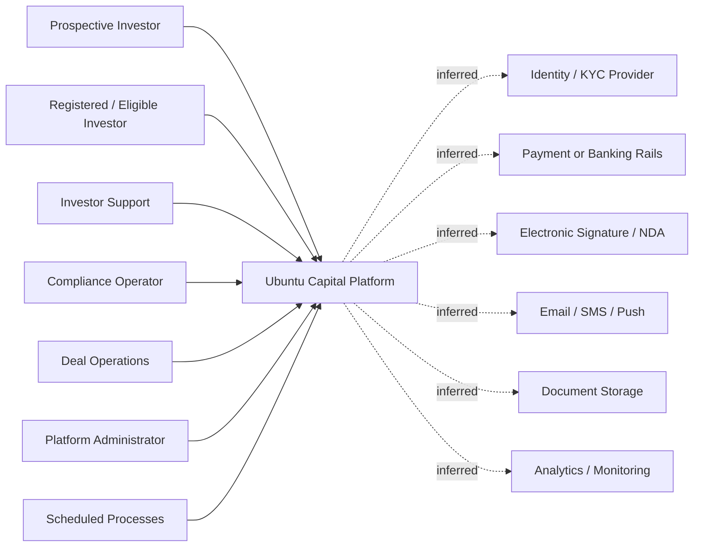

# System Overview

## Evidence status

This reconstruction is based on supplied screenshots of the public OurCrowd website and authenticated portfolio area, supplied URLs, and a prior reverse-engineering report. No source code, database schema, API specification, administrator interface, executed investment transaction, or authenticated session observation was supplied.

## System purpose

Ubuntu Capital is being modelled as a private-markets investment platform inspired by the observed OurCrowd experience. Its intended business outcome is to let eligible investors discover curated private investment opportunities, complete controlled investment steps, and monitor their portfolio and supporting records.

## Confirmed capabilities

The supplied screenshots confirm that the observed reference platform exposes:

- a public marketing website;
- an authenticated portfolio home route;
- opportunity discovery sections including trending and new opportunities;
- asset-class navigation;
- portfolio-related news;
- navigation entries for opportunities, news, investment guidance, events, pending investments, performance, holdings, reports and tax documents, activities, profile, referral and support;
- opportunity cards and calls to action;
- at least one NDA-related action in the opportunity experience.

## Inferred capabilities

The following are reasonable inferences, not confirmed implementation facts:

- registration, authentication, logout, session management and access recovery;
- investor eligibility or accreditation checks;
- KYC/AML and jurisdiction checks;
- opportunity detail and due-diligence document access;
- investment commitment, payment or wire settlement, confirmation and cancellation;
- portfolio valuation, reporting and tax-document generation;
- notification, audit and administrative operations;
- external integrations for identity, compliance, communications, payments and document storage.

## Primary users

- Prospective investor
- Registered investor
- Eligible/accredited investor
- Active portfolio investor
- Investor support or relationship manager
- Compliance operator
- Investment/deal operator
- Platform administrator
- Automated scheduler or integration service

Only the general investor-facing role is directly supported by the supplied UI. Internal roles remain inferred.

## Major business capabilities

1. Investor acquisition and education
2. Identity, access and investor profile management
3. Eligibility and compliance onboarding
4. Opportunity discovery and evaluation
5. NDA and controlled-document access
6. Investment commitment and settlement
7. Pending-investment management
8. Holdings and portfolio-performance management
9. News, events and investor engagement
10. Reports, tax documents and activity history
11. Notifications and support
12. Administration, compliance, audit and operations

## Main entities

Confirmed from visible terminology:

- Investor
- Opportunity
- Investment
- Holding
- Portfolio activity
- Report or tax document
- News item
- Event or webinar
- NDA acknowledgement

Inferred entities:

- Investor profile
- Eligibility/accreditation record
- KYC/AML case
- Commitment
- Payment or settlement instruction
- Valuation
- Notification
- Audit event
- Support case

## System boundary

Ubuntu Capital includes the investor-facing web application, domain services, persistence, workflow controls, reporting, operational support and integration adapters. External identity verification, KYC/AML, payment rails, email/SMS, e-signature, document storage, analytics and tax/reporting providers should remain outside the core boundary until confirmed.

## Primary lifecycle

```text
Visitor
  → Registered Investor
    → Profile/Eligibility Review
      → Eligible Investor
        → Opportunity Discovery
          → Opportunity Evaluation / NDA
            → Investment Commitment
              → Pending Investment
                → Settled Holding
                  → Portfolio Monitoring / Reporting / Exit
```

Every step after opportunity discovery requires validation against the working reference system.

## Primary value

The platform reduces friction in accessing, evaluating and managing curated private-market investments while providing a controlled investor experience, portfolio visibility and supporting records.

## System context


