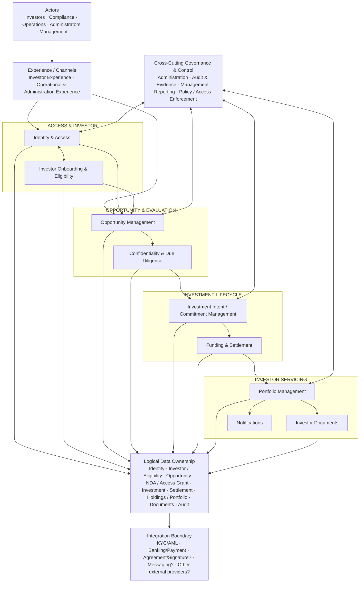

# Ubuntu Capital OS — High-Level Logical Architecture v0.1

**Architecture level:** Level 1 — High-Level Architecture Map  
**Status:** Working architecture baseline  
**Version:** v0.1

## Purpose

Provide the stable logical architecture map for Ubuntu Capital OS. The map shows the major business capabilities, ownership boundaries, governance plane, logical data domains and integration boundary without prematurely selecting cloud services, deployment topology or implementation technologies.

Each detailed use-case analysis must zoom into a relevant part of this map rather than create a disconnected architecture.

## High-Level Logical Architecture



## Major Architecture Capabilities

| Architecture Area | Authoritative Responsibility | Key Collaborators | Status |
|---|---|---|---|
| Identity & Access | Authentication, authorised session/access identity, protected-route access | Onboarding, administration, audit | Inferred / required |
| Investor Onboarding & Eligibility | Investor profile, eligibility, verification and compliance state | IAM, KYC/AML integration, audit | Inferred / priority |
| Opportunity Management | Opportunity information, publication and discoverability lifecycle | Eligibility, due diligence, administration | Mixed evidence |
| Confidentiality & Due Diligence | NDA state, access grants and restricted-material access decisions | Opportunity, IAM, audit, agreement integration? | NDA trigger confirmed; lifecycle inferred |
| Investment Intent / Commitment | Expression of interest / commitment and pending investment state | Eligibility, opportunity, DD, operations, audit | Inferred; legal meaning unresolved |
| Funding & Settlement | Funding instructions, received-funds status and reconciliation | Investment, banking/payment integration, audit | Unknown / required later |
| Portfolio Management | Holdings, portfolio state and performance views | Investment, settlement, documents | Navigation confirmed; business rules inferred |
| Investor Documents | Authorised report and tax-document availability | Portfolio, IAM | Navigation confirmed; generation unknown |
| Notifications | Delivery of material platform events | Multiple business domains | Inferred |
| Governance & Control | Administrative actions, audit evidence, management reporting and policy enforcement | Cross-cutting | Priority / cross-cutting |

## Capability Ownership Rules

Every material business fact should have one authoritative architectural owner.

| Business Fact | Authoritative Owner |
|---|---|
| User authentication / access identity | Identity & Access |
| Investor eligibility / compliance state | Investor Onboarding & Eligibility |
| Opportunity publication / availability state | Opportunity Management |
| NDA / confidential access state | Confidentiality & Due Diligence |
| Expression-of-interest / commitment state | Investment Intent / Commitment |
| Funds-reconciled state | Funding & Settlement |
| Holding / portfolio ownership state | Portfolio Management |
| Investor document availability | Investor Documents |
| Material audit evidence | Audit & Evidence |

## Architecture Rules

### 1. One authoritative owner per business fact

Capabilities may consume each other's state, but should not independently maintain competing interpretations of the same business fact.

### 2. Investment is not automatically a holding

No investor action should create a holding merely because a user clicked an investment button. Eligibility, legal acceptance, funding receipt, reconciliation and ownership-creation rules must be explicit and auditable.

### 3. Logical architecture is not deployment architecture

The boxes in this map do **not** imply:

- microservices;
- modular monolith;
- AWS, Azure or GCP;
- serverless;
- containers;
- queues;
- one database per capability;
- event-driven architecture.

Those decisions remain intentionally deferred until use-case and NFR analysis provides sufficient architectural drivers.

### 4. Integrations do not own Ubuntu Capital OS business state

External providers may perform verification, move money, sign agreements or deliver messages. Ubuntu Capital OS remains authoritative for platform decisions and internal lifecycle state.

### 5. Governance is cross-cutting

Administration, permissions, audit and management reporting must apply across material business domains rather than be designed as isolated end-stage features.

## Critical Open Architecture Decisions

### Investor eligibility model

Unknowns include supported jurisdictions, accreditation criteria, evidence requirements and access rules.

### Legal meaning of UC-INV-001

UC-INV-001 may later represent an expression of interest, reservation, subscription or binding commitment. Until legal, settlement and ownership rules are confirmed, the first implementation slice should treat it as a **non-binding expression of interest**.

### Settlement operating model

Banking mechanism, client-money/custody model, reconciliation process, exception handling and refund model remain unresolved.

### Legal ownership model

The platform has not yet established whether a holding represents direct ownership, an SPV interest, fund interest, nominee arrangement or another structure.

### Opportunity lifecycle

Authoritative lifecycle states and transitions remain to be validated.

### NDA mechanism

The existence of an NDA action is confirmed, but signing mechanism, versioning, expiry, revocation and approval rules remain unresolved.

### Internal permission model

Exact internal roles, scopes and segregation-of-duties rules require validation.

### Portfolio calculations

Valuation sources, performance formulas, cash-flow handling and fee treatment remain unresolved.

## HLA Versioning Rule

The HLA should change only when a use-case zoom-in reveals one or more of the following:

- new capability;
- missing domain;
- changed responsibility boundary;
- new external integration;
- shared capability;
- data-ownership issue;
- security boundary;
- workflow/orchestration concern;
- major NFR;
- architecture decision.

A different implementation option by itself is not sufficient reason to alter the HLA.

## Architecture Evolution

```text
HLA v0.1
   ↓
Use Case Analysis
   ↓
Mini-Architecture
   ↓
Impact Assessment
   ├─ No HLA change
   ├─ HLA clarification
   ├─ New capability
   ├─ Boundary change
   ├─ New integration
   └─ Architecture decision
   ↓
HLA v0.2 when justified
```

## Source Basis

- Ubuntu Capital OS — *Priority Use Cases & Business Benefits*, 09 August 2026.
- Current master use-case catalogue.
- Current functional-domain map.
- Current system overview, evidence register and open-question register.
