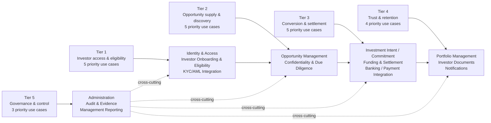
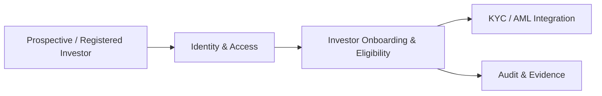
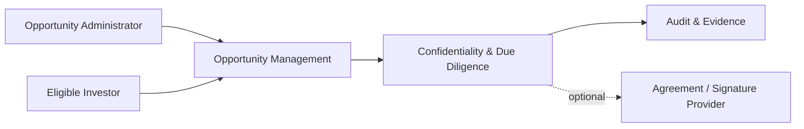
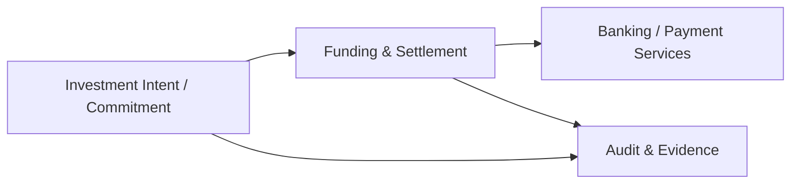
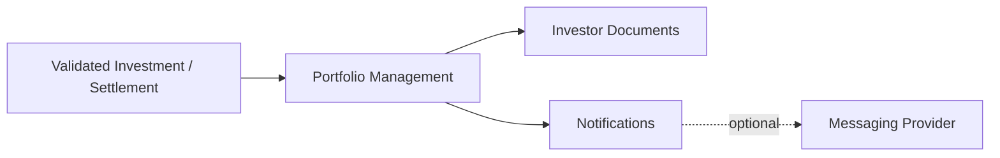
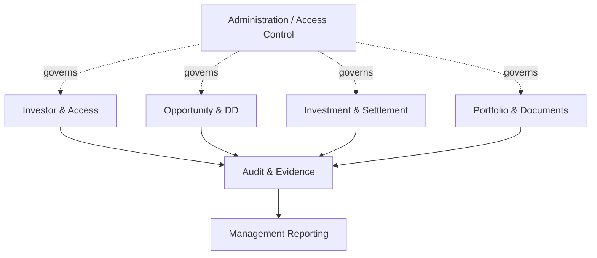

# Ubuntu Capital OS — Priority Use Case → Architecture Map

**Architecture level:** Use-Case Navigation Index  
**Status:** Working architecture baseline  
**Version:** v0.1

## Purpose

Map the 22 priority use cases to the relevant sections of the High-Level Logical Architecture so that each future use-case analysis starts from an existing architectural context rather than designing an isolated solution.

## How to Use This Map

```text
Select Use Case
      ↓
Locate Primary Capability
      ↓
Include Supporting Capabilities
      ↓
Identify External Integrations
      ↓
Zoom Into HLA Section
      ↓
Create Mini-Architecture
      ↓
Assess Impact Back Into HLA
```

## Priority Tier → Architecture Area



## Tier 1 — Investor Access and Regulatory Eligibility

| Use Case | Use Case Name | Primary Capability | Supporting Capabilities | External System | Architecture Zoom Area |
|---|---|---|---|---|---|
| UC-IAM-001 | Sign in to the investor portal | Identity & Access | Audit / access policy | Identity provider? | Access |
| UC-ONB-001 | Register as a prospective investor | Investor Onboarding | IAM, Audit | — | Investor |
| UC-ONB-002 | Complete investor profile and eligibility onboarding | Investor Onboarding & Eligibility | IAM, Audit | — | Investor |
| UC-ONB-003 | Verify identity and compliance status | Investor Onboarding & Eligibility | IAM, Audit | KYC/AML provider | Investor |
| UC-INT-001 | Exchange KYC/AML data with an external provider | Integration / Eligibility | Audit | KYC/AML provider | Investor / Integration |

### Tier 1 Architecture Focus



## Tier 2 — Opportunity Supply and Investor Discovery

| Use Case | Use Case Name | Primary Capability | Supporting Capabilities | External System | Architecture Zoom Area |
|---|---|---|---|---|---|
| UC-ADMIN-001 | Create and publish an investment opportunity | Opportunity Management | Administration, Audit | — | Opportunity |
| UC-OPP-001 | Browse opportunity cards and categories | Opportunity Management | IAM, Eligibility | — | Opportunity |
| UC-OPP-003 | View an opportunity detail page | Opportunity Management | IAM, Eligibility, DD | — | Opportunity |
| UC-DD-001 | Initiate an NDA action | Confidentiality & Due Diligence | Opportunity, IAM, Audit | Agreement provider? | Due Diligence |
| UC-DD-002 | Access confidential due-diligence materials | Confidentiality & Due Diligence | Opportunity, IAM, Audit | Document / signature provider? | Due Diligence |

### Tier 2 Architecture Focus



## Tier 3 — Investment Conversion and Capital Movement

| Use Case | Use Case Name | Primary Capability | Supporting Capabilities | External System | Architecture Zoom Area |
|---|---|---|---|---|---|
| UC-INV-001 | Submit an investment commitment / expression of interest | Investment Intent / Commitment | Eligibility, Opportunity, DD, Audit | — | Investment |
| UC-INV-002 | Review and resolve a pending investment | Investment Intent / Commitment | Operations, Audit, Notifications | — | Investment |
| UC-SET-001 | Receive funding instructions | Funding & Settlement | Investment, Eligibility | Banking? | Settlement |
| UC-SET-002 | Record and reconcile investor funds | Funding & Settlement | Investment, Audit | Banking / payment services | Settlement |
| UC-INT-004 | Exchange settlement data with banking or payment services | Integration / Settlement | Audit | Banking / payment services | Settlement / Integration |

### Tier 3 Architecture Focus



### Critical Interpretation Rule

UC-INV-001 must not automatically be treated as a binding financial transaction. Until legal, settlement and ownership rules are confirmed, the first implementation slice should treat it as a **non-binding expression of interest**.

## Tier 4 — Investor Trust and Retention

| Use Case | Use Case Name | Primary Capability | Supporting Capabilities | External System | Architecture Zoom Area |
|---|---|---|---|---|---|
| UC-PORT-002 | View current holdings | Portfolio Management | Investment, Settlement, IAM | — | Portfolio |
| UC-PORT-003 | View portfolio performance | Portfolio Management | Holdings, valuation / reporting | Valuation data? | Portfolio |
| UC-DOC-001 | Download reports and tax documents | Investor Documents | Portfolio, IAM | Unknown | Documents |
| UC-NOTIFY-001 | Receive material notifications | Notifications | Multiple business domains | Messaging provider? | Shared Capability |

### Tier 4 Architecture Focus



## Tier 5 — Governance and Enterprise Control

| Use Case | Use Case Name | Primary Capability | Supporting Capabilities | External System | Architecture Zoom Area |
|---|---|---|---|---|---|
| UC-ADMIN-003 | Manage users, roles and permissions | IAM / Administration | Audit | — | Governance |
| UC-AUD-001 | Record and review audit events | Audit & Evidence | All material domains | — | Governance |
| UC-REPORT-001 | Produce operational and compliance reports | Management Reporting | Investor, Investment, Settlement, Audit | — | Governance |

### Tier 5 Architecture Focus



## Recommended MVP Navigation

The current recommended first vertical slice traverses:

```text
Identity
   ↓
Eligibility
   ↓
Opportunity Discovery
   ↓
Confidentiality / NDA Gate
   ↓
Non-Binding Expression of Interest
   ↓
Audit Evidence
```

Settlement and binding financial obligation remain deferred until legal and financial operating rules are confirmed.

## Use-Case Analysis Rule

When any use case is selected, begin with:

### Architecture Map Location

- **Primary capability**
- **Supporting capabilities**
- **External integrations**
- **HLA section being zoomed into**

Then conduct detailed analysis using:

**Requirement → Current State → Target Architecture → Gap**

At the end, produce:

### Mini-Architecture

followed by:

### Impact on High-Level Architecture

Classify the outcome as one of:

- No HLA change required
- HLA clarification required
- New capability discovered
- Capability boundary changed
- New integration discovered
- Architecture decision required

## Source Basis

This map is based on the 22 priority use cases in Ubuntu Capital OS — *Priority Use Cases & Business Benefits*, 09 August 2026. The 22 priority use cases remain a prioritised subset of the current 41-use-case catalogue and do not replace the master catalogue.
