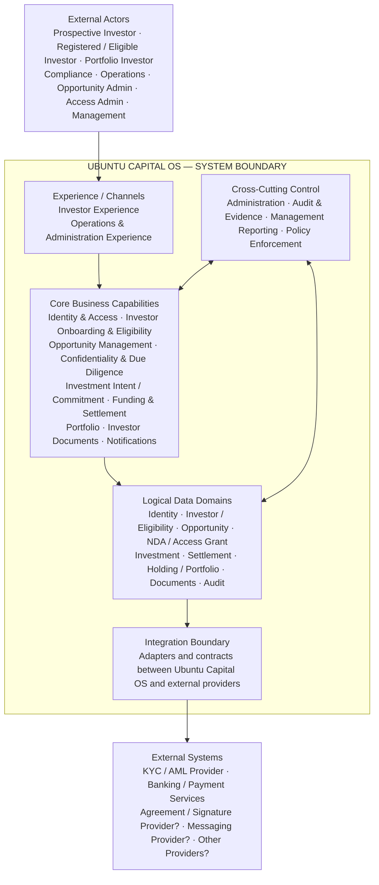

# Ubuntu Capital OS — System Boundary View

**Architecture level:** Level 0 — System Context  
**Status:** Working architecture baseline  
**Version:** v0.1

## Purpose

Define who interacts with Ubuntu Capital OS, what responsibilities sit inside the platform boundary, and which capabilities remain external. This prevents scope creep and keeps later use-case mini-architectures aligned to a common system context.

## System Boundary



## Actors

| Actor | Primary Interaction |
|---|---|
| Prospective Investor | Public experience, registration and onboarding |
| Registered / Eligible Investor | Authenticated opportunity discovery and controlled investment journeys |
| Portfolio Investor | Holdings, performance, reports and servicing |
| Compliance Operator | Investor verification, compliance review and evidence |
| Investment / Operations Operator | Pending-investment and settlement operations |
| Opportunity Administrator | Opportunity creation and publication |
| Access Administrator | Users, roles, permissions and data scope |
| Management | Operational and compliance reporting |

## Inside Ubuntu Capital OS

Ubuntu Capital OS owns:

- investor-facing and operational experiences;
- platform identity and access decisions;
- investor profile, eligibility and compliance state;
- opportunity information and publication lifecycle;
- NDA requirements, access grants and confidential-information controls;
- investment intent / commitment state;
- funding instructions and settlement / reconciliation state;
- holdings and portfolio state;
- investor-facing documents and notifications;
- permissions, audit evidence and management reporting;
- logical platform data and integration contracts.

## Outside Ubuntu Capital OS

The following remain external unless later architecture decisions explicitly change the boundary:

- KYC / AML verification provider;
- banking and payment services;
- electronic agreement / signature provider;
- messaging provider;
- other specialist external services.

External providers may supply verification results, financial events or delivery outcomes, but they do not become authoritative owners of Ubuntu Capital OS business state.

## Boundary Responsibilities

| Boundary Area | Inside Ubuntu Capital OS | Outside Ubuntu Capital OS |
|---|---|---|
| Actors & channels | Investor and operational experiences; authenticated/private journeys | Human actors themselves |
| Investor control | Eligibility state, access decisions, verification evidence and platform policy | KYC/AML provider performing external verification checks |
| Opportunity & confidentiality | Opportunity lifecycle, NDA requirement, access grants and restricted-content decisions | External e-signature/agreement mechanism if selected |
| Investment & settlement | Investment intent/commitment state, funding instructions and reconciliation state | Banking/payment rails moving or confirming money |
| Servicing | Holdings, portfolio views, documents and notifications | External delivery channels or third-party data feeds where used |
| Governance | Permissions, audit evidence and management reporting | External regulators/auditors consuming approved outputs |

## Architecture Rules

1. **External integrations are not internal business domains.**
2. **Ubuntu Capital OS remains authoritative for its business state and decisions.**
3. **A logical capability does not automatically imply a separate deployable service.**
4. **This boundary view is technology-neutral.** It does not select cloud services, databases, queues, containers, microservices or deployment topology.
5. **Detailed use-case architectures must remain inside this boundary unless a validated requirement introduces a new external actor or integration.**

## Evidence Status

- **Confirmed:** investor-facing platform experience, opportunity discovery, portfolio-related navigation, NDA action presence.
- **Inferred / required:** internal operational roles, onboarding/eligibility controls, audit, administration and notification capabilities.
- **Unknown / requires validation:** exact vendors, agreement mechanism, settlement operating model and complete internal role model.

## Source Basis

- Ubuntu Capital OS — *Priority Use Cases & Business Benefits*, 09 August 2026.
- Current system overview and functional-domain model in the repository.
- Current evidence and open-question registers.

## Architecture Use

This document is the Level 0 reference point for subsequent architecture work:

```text
System Boundary View
        ↓
High-Level Architecture Map
        ↓
Selected Use Case
        ↓
Mini-Architecture
        ↓
Impact back into the HLA
```
