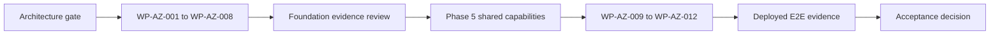

# Ubuntu Capital OS Blueprint — Solution Architecture Readiness Audit

**Document status:** Architecture governance assessment  
**Assessment date:** 2026-08-31  
**Blueprint assessed:** `Ubuntu_Capital_OS_Blueprint(2).pdf`  
**Repository assessed:** `IsaacMcGrind/ubuntu-capital-os`  
**Evidence branch:** `master`  
**Evidence commit:** `d2d6f7bfe90ef04ec846eb11308cf551977cd33d`  
**Target documentation branch:** `corefinity-docs`  
**SA recommendation:** `NO-GO FOR UNRESTRICTED IMPLEMENTATION`

## 1. Purpose

This document audits the Ubuntu Capital OS Blueprint against current repository evidence from a Solution Architect perspective.

It distinguishes:

- architecture direction from implementation evidence;
- satisfied design controls from unresolved decisions;
- component or prototype evidence from end-to-end completion;
- Solution Architect deliverables from engineering execution evidence.

## 2. Executive conclusion

The Blueprint is a defensible **target-architecture presentation**. It correctly separates logical capabilities, Azure implementation, identity responsibilities and the business-audit boundary.

The repository does not yet support an implementation-readiness claim:

| Measure | Current evidence |
|---|---:|
| Use cases mapped | 41 |
| UI-level `COMPONENT_COMPLETE` | 7 |
| `IN_DEVELOPMENT` | 16 |
| `READY_FOR_DEVELOPMENT` | 18 |
| Fully `COMPLETE` use cases | 0 |
| End-to-end evidence | `NONE` |
| Azure Foundation evidence gates satisfied | 0 of 8 |
| Complete traceability chains | 0 |
| Partial traceability chains | 5 |

## 3. Satisfied architecture controls

`SATISFIED` means the architecture direction or responsibility has been established. It does not mean the software is implemented.

| Control | Status | What is satisfied |
|---|---|---|
| Architecture levels separated | `SATISFIED` | Business capabilities are not collapsed into Azure services. |
| MVP cloud platform selected | `SATISFIED` | `ARCH-ADR-001` confirms Azure as the MVP platform direction. |
| Core Azure mapping | `SATISFIED` | Static Web Apps, Entra External ID, Functions, SQL, Blob, Key Vault and monitoring are mapped. |
| Authentication separated from eligibility | `SATISFIED` | Entra authenticates; Ubuntu Capital owns eligibility and business authorization. |
| Frontend security boundary identified | `SATISFIED` | React route protection is not treated as authoritative API enforcement. |
| Telemetry separated from audit | `SATISFIED` | Application Insights/Azure Monitor do not replace `UC-AUD-001`. |
| Settlement deferred | `SATISFIED` | Money movement, custody, holdings and valuation are outside the first slice. |
| Architecture versus implementation distinguished | `SATISFIED` | Blueprint diagrams are explicitly target-state artifacts, not deployment proof. |
| Foundation evidence gates defined | `SATISFIED` | Required evidence for `WP-AZ-001` through `WP-AZ-008` is documented. |

## 4. Partially satisfied controls

| Control | Status | Existing evidence | Remaining gap |
|---|---|---|---|
| MVP scope | `PARTIAL` | First slice is constrained to a non-binding EOI. | Legal/business confirmation remains open under `OQ-003`. |
| Logical capability model | `PARTIAL` | Identity, Eligibility, Opportunity, NDA, Intent and Audit are mapped. | Formal capability and data owners are not approved. |
| Actor model | `PARTIAL` | Investor and operator actors are identified. | Internal operator roles and authority remain inferred. |
| Opportunity access policy | `PARTIAL` | Eligibility and NDA controls are shown. | Pre/post eligibility, NDA and EOI visibility rules remain open. |
| NDA flow | `PARTIAL` | NDA and protected access capability exists in the target. | Trigger, version, expiry, revocation and e-signature lifecycle are unresolved. |
| Logical-to-Azure mapping | `PARTIAL` | Capabilities map to React, Functions and storage. | API contracts, module boundaries and authoritative data ownership remain incomplete. |
| Identity implementation | `PARTIAL` | Prototype route guards and local session tests exist. | Entra, backend token validation and server-side policy enforcement do not. |
| EOI implementation | `PARTIAL` | Local validation and duplicate protection exist. | Backend lifecycle, persistence, audit and integrated failure paths are absent. |
| Validation | `PARTIAL` | Lint, build and six limited tests pass. | Security, persistence, integration and E2E validation are absent. |
| Traceability | `PARTIAL` | Five trace chains exist. | All remain partial; no complete MVP trace chain exists. |
| ADR coverage | `PARTIAL` | Azure platform ADR is confirmed. | Application, security, audit, data and operational decisions remain undocumented. |

## 5. Not satisfied controls

### 5.1 Business and logical architecture

| Control | Status | Required closure evidence |
|---|---|---|
| EOI legal meaning | `NOT SATISFIED` | Product/Legal decision resolving `OQ-003`. |
| Eligible jurisdictions | `NOT SATISFIED` | Approved jurisdiction and regulatory matrix. |
| Eligibility/accreditation policy | `NOT SATISFIED` | Approved policy rules, inputs and example outcomes. |
| NDA policy | `NOT SATISFIED` | Agreement lifecycle, evidence and access rules. |
| Opportunity lifecycle | `NOT SATISFIED` | Approved states, transitions and publishing authority. |
| Roles and permissions | `NOT SATISFIED` | Approved positive and negative permission matrix. |
| Segregation of duties | `NOT SATISFIED` | Approved operator/compliance/access-admin boundaries. |
| Logical data ownership | `NOT SATISFIED` | Accepted owners for Account, Eligibility, Opportunity, NDA Grant, EOI and Audit Event. |

### 5.2 Technical architecture

| Control | Status |
|---|---|
| Entra External ID integration | `NOT SATISFIED` |
| Protected Azure Functions API | `NOT SATISFIED` |
| Server-side authorization | `NOT SATISFIED` |
| Azure SQL schema and migrations | `NOT SATISFIED` |
| Durable business-audit pipeline | `NOT SATISFIED` |
| Key Vault and Managed Identity integration | `NOT SATISFIED` |
| Reproducible infrastructure and CI/CD | `NOT SATISFIED` |
| Protected document access | `NOT SATISFIED` — Blob is selected but deferred |
| First-slice API and error contracts | `NOT SATISFIED` |

### 5.3 Production and NFR architecture

The following are not approved or evidenced:

- threat model and trust boundaries;
- privacy, retention, deletion and data-residency rules;
- availability and performance targets;
- capacity assumptions;
- RTO and RPO;
- backup and restore testing;
- operational ownership and incident response;
- measurable cost guardrails;
- security and operational readiness review.

## 6. Blocked delivery gates

All Foundation work packages remain `READY_FOR_DEVELOPMENT` with execution `BLOCKED_BY_CONTEXT`:

| Work package | Capability | Evidence gate |
|---|---|---|
| `WP-AZ-001` | Azure resource baseline | Not satisfied |
| `WP-AZ-002` | Static Web Apps deployment | Not satisfied |
| `WP-AZ-003` | Entra External ID | Not satisfied |
| `WP-AZ-004` | Protected Functions API | Not satisfied |
| `WP-AZ-005` | Azure SQL persistence | Not satisfied |
| `WP-AZ-006` | Key Vault and Managed Identity | Not satisfied |
| `WP-AZ-007` | Application Insights and Azure Monitor | Not satisfied |
| `WP-AZ-008` | Infrastructure as Code and CI/CD | Not satisfied |

`WP-AZ-009` through `WP-AZ-012` must not start until the Foundation evidence gates and controlling Phase 5 exit criteria are satisfied.

## 7. Blueprint corrections required

| Blueprint issue | Required correction |
|---|---|
| Non-binding EOI appears fully settled | Mark as the controlled first-slice assumption pending Product/Legal closure of `OQ-003`. |
| Authorised operator appears approved | Label as target operator; permissions pending approval. |
| Blob appears part of active Foundation | Label as selected target, deferred until a controlled-document use case. |
| NDA appears mandatory for every EOI | Make NDA conditional on opportunity/resource policy. |
| Mapping omits data ownership | Add the authoritative logical owner per business entity. |
| Identity flow appears implemented | Mark as target flow; current implementation is frontend session simulation. |
| Readiness path uses four generic gates | Replace with the controlling governance and delivery sequence below. |
| Evidence baseline absent | Add repository, branch, commit SHA and assessment date. |

## 8. Solution Architect next steps

### P0 — Close before Foundation implementation

1. Reconcile Phase 0–4 repository outputs and integrity rules.
2. Resolve EOI, jurisdiction, eligibility, NDA and operator-authority decisions.
3. Approve the actor, role, permission and negative-access model.
4. Approve logical data owners and state transitions.
5. Complete the threat model, privacy model and authorization design.
6. Complete the first-slice API, error, audit, persistence and integration contracts.
7. Approve measurable availability, performance, recovery, retention and cost NFRs.
8. Complete the ADR set.
9. Reconcile the **pre-start planned traceability chain** for the proposed Foundation/first-slice scope as `source -> use case -> backlog -> architecture/design (where applicable) -> planned implementation target -> planned test/validation -> planned durable-evidence target -> planned tracker/status`. Actual implementation, test-run, deployment and durable-evidence records are not required before authorised execution because they cannot exist for not-yet-started work.
10. Run an Architecture Readiness Review. A non-authorising `NO-GO` may be recorded immediately while blockers remain. An execution-authorising `GO` or explicitly scoped `CONDITIONAL GO` may be recorded only after the non-waivable closure set, required planned pre-start traceability and readiness-decision authority reconcile.

### P1 — Execute only after the readiness gate opens

After an effective authorised `GO` or explicitly scoped `CONDITIONAL GO`, replace the applicable planned targets progressively with the **realised delivery chain**: `source -> use case -> backlog -> architecture/design (where applicable) -> implementation evidence -> test/run evidence -> durable evidence -> validation/status`. Missing required realised hops block work-package/use-case status promotion, E2E readiness and acceptance; they do not make the pre-start decision circular.

## 9. Minimum remaining ADR set

1. Entra authentication versus Ubuntu Capital authorization.
2. Modular backend hosted on Azure Functions.
3. Azure SQL physical storage and logical ownership.
4. Business-audit persistence.
5. Blob Storage deferral and access model.
6. First-slice synchronous interaction model.
7. Environment and deployment topology.
8. Error, correlation and idempotency conventions.

## 10. Final recommendation

The Blueprint establishes a useful target architecture, but current evidence does not support unrestricted implementation or MVP acceptance.

**Recommendation:** `NO-GO FOR UNRESTRICTED IMPLEMENTATION` until the Architecture Readiness Closure Pack and formal readiness review are complete.

## 11. Primary repository evidence

- `docs/00-context/source-inventory.md`
- `docs/02-architecture/azure-mvp-platform-decision.md`
- `docs/02-actors-and-permissions/permissions-matrix.md`
- `docs/09-delivery/implementation-coverage-gap-matrix.md`
- `docs/09-delivery/e2e-delivery-tracker.md`
- `docs/09-delivery/foundation-slice-a-evidence-register.md`
- `docs/09-delivery/foundation-slice-a-governance-reconciliation.md`
- `docs/09-delivery/pre-implementation-gate-reassessment-2026-09-03.md`
- `docs/10-traceability/traceability-matrix.md`
- `docs/11-open-questions/open-questions.md`
- `docs/12-validation/validation-plan.md`
- `docs/13-risks/gap-and-risk-register.md`
