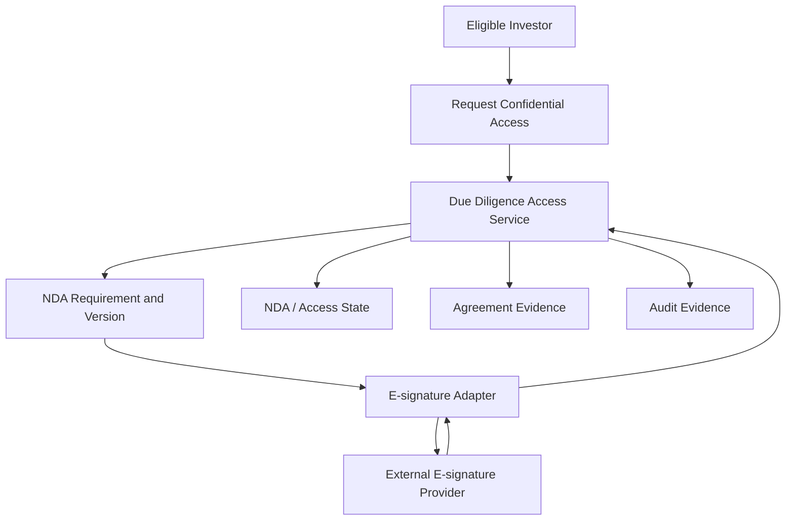

# UC-DD-001 - Initiate an NDA Action

**Domain:** Due Diligence and Confidential Access  
**Primary Actor:** Eligible Investor  
**Supporting Actors:** E-signature Provider; Deal/Compliance Operator  
**Priority:** High - Priority Tier 2  
**Architecture Status:** Architecture candidate complete - legal/e-signature decisions pending  
**Requirement Evidence:** INFERRED  
**Implementation Status:** IN_DEVELOPMENT  
**E2E Evidence:** NONE  
**Business Use Case Complete:** No  
**Analysis Mode:** Deep Dive  
**Last Updated:** 2026-09-03

## 1. Purpose

Initiate the correct NDA process for an investor and opportunity while preserving the agreement version, parties, outcome, and evidence required for a later access decision. Clicking “request data room” is not evidence that an NDA exists or access is granted.

## 2. Source Basis

- `docs/04-use-cases/UC-DD-001.md`
- `docs/05-business-rules/business-rules.md`
- `docs/07-state-models/state-models.md`
- `docs/08-integrations/integration-catalogue.md`
- `docs/11-open-questions/open-questions.md`
- `docs/02-architecture/high-level-logical-architecture-v0.1.md`
- `docs/02-architecture/azure-mvp-platform-decision.md`
- `docs/09-delivery/implementation-coverage-gap-matrix.md`
- Ubuntu Capital OS Priority Use Cases and Business Benefits, 09 August 2026

## 3. Architecture Analysis

### 3.1 Requirement

The platform must determine whether an NDA is required, identify the applicable agreement/version and parties, initiate acceptance/signature, correlate the result, preserve evidence, and create a controlled NDA/access state.

### 3.2 Current State

`src/pages/DealDetail.tsx` has a “Request data room” action. No NDA rule evaluation, agreement catalogue, e-signature integration, signature evidence, lifecycle state, revocation/expiry handling, or protected access enforcement is evidenced.

### 3.3 Target Architecture

Due Diligence owns the NDA process and access-grant state. Document Management owns controlled agreement artifacts. An e-signature adapter initiates external signing and receives verified completion events. A completed signature is an input to, not a substitute for, the platform access-grant decision.

### 3.4 Gap

| Requirement | Current State | Target Architecture | Gap |
|---|---|---|---|
| Initiate and evidence an applicable NDA process | UI affordance only | Versioned agreement workflow integrated with e-signature and access state | Define legal model; implement workflow, document versioning, callbacks, evidence, grant decision and tests |

## 4. Business and Logical Flow

**Inputs:** investor, opportunity, eligibility/access context, agreement version, signing-party data.  
**Outputs:** NDA request, signing reference, state transition, signed artifact/evidence reference, access decision trigger.  
**Exceptions:** no applicable agreement, declined/expired signing, wrong signer, duplicate request, provider failure, superseded agreement.

## 5. Responsibility and Data Ownership

| Data/entity | Authoritative owner |
|---|---|
| NDA workflow and access state | Due Diligence |
| Agreement template/version and signed artifact | Document Management / controlled evidence store |
| External signing transaction | E-signature provider; referenced by Ubuntu Capital |
| Eligibility | Investor Onboarding and Eligibility |
| Opportunity restriction policy | Opportunity Management / Due Diligence boundary |

## 6. Azure Technical Direction

Protected Azure Functions coordinate the NDA workflow and expose provider callbacks. Azure SQL stores agreement/version, transaction, and access state; Blob Storage stores immutable signed artifacts using mediated access. Key Vault protects provider credentials. Callback verification, replay protection, idempotency, correlation, and state-transition checks are mandatory.

## 7. Production and NFR Considerations

- Preserve exact agreement version, parties, timestamps, signature reference, and artifact integrity hash.
- Prevent access while signing is pending, failed, declined, expired, or superseded.
- Do not expose signed documents through public/static URLs.
- Monitor stuck transactions, provider failures, callback validation failures, and grant anomalies.
- Define retention, legal admissibility, re-signing, revocation, and data-residency rules.

## 8. Decisions

| ID | Decision | Status |
|---|---|---|
| DD1-D01 | Due Diligence owns NDA workflow and confidential-access state. | Proposed / HLA-confirming |
| DD1-D02 | Agreement versions and signed artifacts are immutable evidence references. | Proposed |
| DD1-D03 | Provider completion does not directly bypass Ubuntu Capital access policy. | Proposed |
| DD1-D04 | Provider callbacks are verified and processed idempotently. | Proposed |

**Blocking/needs review:** whether click-wrap or signature is legally sufficient, e-signature provider, signer authority, agreement selection/version rules, expiry/revocation/re-sign rules, manual approval requirement, retention.

## 9. Related Use Cases and HLA Impact

Related: `UC-OPP-003`, `UC-DD-002`, `UC-INT-002`, `UC-ONB-003`, `UC-AUD-001`, `UC-DOC-001`.  
**HLA impact:** Modify Due Diligence to show agreement evidence and access-grant state separately; add an e-signature adapter at the integration boundary.

## 10. Status Summary

- Architecture analysis: candidate complete
- Architecture approval: pending legal/e-signature decisions
- Implementation: `IN_DEVELOPMENT` (trigger affordance only)
- E2E evidence: none
- Business use case complete: no

