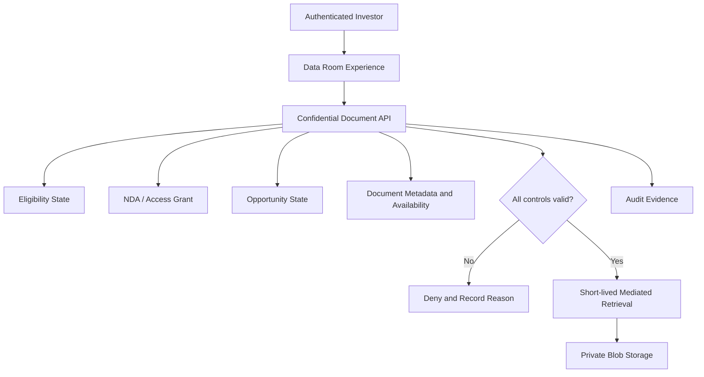

# UC-DD-002 - Access Confidential Due-Diligence Materials

**Domain:** Due Diligence and Confidential Access  
**Primary Actor:** Eligible Investor with Required Access Grant  
**Priority:** High - Priority Tier 2  
**Architecture Status:** Architecture candidate complete - access-lifecycle decisions pending  
**Requirement Evidence:** INFERRED  
**Implementation Status:** READY_FOR_DEVELOPMENT  
**E2E Evidence:** NONE  
**Business Use Case Complete:** No  
**Analysis Mode:** Deep Dive  
**Last Updated:** 2026-09-03

## 1. Purpose

Allow an authorised investor to discover and retrieve confidential opportunity materials only while all required identity, eligibility, NDA, opportunity, and document conditions remain valid.

## 2. Source Basis

- `docs/04-use-cases/UC-DD-002.md`
- `docs/05-business-rules/business-rules.md`
- `docs/07-state-models/state-models.md`
- `docs/08-integrations/integration-catalogue.md`
- `docs/11-open-questions/open-questions.md`
- `docs/02-architecture/high-level-logical-architecture-v0.1.md`
- `docs/02-architecture/azure-mvp-platform-decision.md`
- `docs/09-delivery/implementation-coverage-gap-matrix.md`
- Ubuntu Capital OS Priority Use Cases and Business Benefits, 09 August 2026

## 3. Architecture Analysis

### 3.1 Requirement

The platform must enforce confidential-document access at request time, return only authorised/current materials, prevent uncontrolled direct access, and record sufficient evidence of material access and denial.

### 3.2 Current State

No protected data-room route, document service, server-side authorization, controlled retrieval, access log, revocation, or E2E evidence is found. The use case is `READY_FOR_DEVELOPMENT`.

### 3.3 Target Architecture

Due Diligence owns the access grant. Document Management owns document metadata/version/availability. A protected document-access API composes current identity, eligibility, opportunity, NDA/grant, and document state before issuing a short-lived retrieval response. Blob Storage is never the business policy decision-maker.

### 3.4 Gap

| Requirement | Current State | Target Architecture | Gap |
|---|---|---|---|
| Secure access to confidential materials | No implementation | Request-time policy enforcement and mediated, auditable document delivery | Implement data-room UI/API, grant lifecycle, document metadata/storage, short-lived access, revocation, audit and negative tests |

## 4. Business and Logical Flow

**Inputs:** identity/session, investor/eligibility state, opportunity, access grant, document/version.  
**Outputs:** authorised document listing/retrieval or controlled denial, access evidence.  
**Exceptions:** expired/revoked grant, superseded/withdrawn document, closed opportunity, stale link, storage failure, malicious enumeration.

## 5. Responsibility and Data Ownership

| Data/entity | Authoritative owner |
|---|---|
| Confidential access grant | Due Diligence |
| Document metadata/version/availability | Document Management |
| Binary object | Private Blob Storage under Document Management control |
| Eligibility | Investor Onboarding and Eligibility |
| Authentication | IAM / Entra External ID |
| Access evidence | Audit and Evidence |

## 6. Azure Technical Direction

Static Web Apps calls protected Azure Functions. The API validates the Entra token and business policy, reads state from Azure SQL, and returns content through backend streaming or a narrowly scoped, short-lived Blob access mechanism. Containers remain private; permanent public URLs and client-held storage keys are prohibited. Managed Identity provides backend-to-Blob access.

## 7. Production and NFR Considerations

- Authorize every list and retrieval request; never rely on navigation hiding.
- Use least-privilege projections and non-guessable identifiers without treating obscurity as authorization.
- Make revocation effective quickly; define TTL and cache invalidation policy.
- Audit who accessed which document/version, when, for which opportunity, and outcome.
- Consider watermarking/download policy only after legal/business confirmation.
- Back up metadata/evidence and test restoration; define document RPO/RTO and retention.

| Failure | Business impact | Mitigation |
|---|---|---|
| Stale signed link after revocation | Confidentiality breach | Very short TTL, re-check for sensitive actions, revoke/rotate where supported |
| Authorization defect | Cross-investor disclosure | Central policy checks, deny-by-default, negative tenant/object tests |
| Withdrawn document still cached | Reliance on obsolete information | Versioned metadata, cache invalidation, availability checks |
| Storage unavailable | Due diligence interrupted | Clear degraded response, telemetry/alerting, recovery plan |

## 8. Decisions

| ID | Decision | Status |
|---|---|---|
| DD2-D01 | Due Diligence owns access grants; Document Management owns document lifecycle. | Proposed / HLA-confirming |
| DD2-D02 | Authorization is enforced at every API retrieval, not only at page entry. | Proposed |
| DD2-D03 | Blob Storage remains private and is accessed through mediated, short-lived authorization. | Inherited from ARCH-ADR-001 / proposed control |
| DD2-D04 | A published document and an investor's permission to access it are separate states. | Proposed |

**Needs review:** download vs view-only policy, watermarking, grant expiry/revocation, document classification, access-log retention, operator override, document residency and sharing restrictions.

## 9. Related Use Cases and HLA Impact

Related: `UC-DD-001`, `UC-OPP-003`, `UC-ONB-003`, `UC-DOC-001`, `UC-AUD-001`, `UC-ADMIN-003`.  
**HLA impact:** Confirm Due Diligence and Document Management boundaries; modify the access path to show request-time policy composition and private mediated storage access.

## 10. Status Summary

- Architecture analysis: candidate complete
- Architecture decisions: proposed; access/legal policy pending
- Implementation: `READY_FOR_DEVELOPMENT`
- E2E evidence: none
- Business use case complete: no

