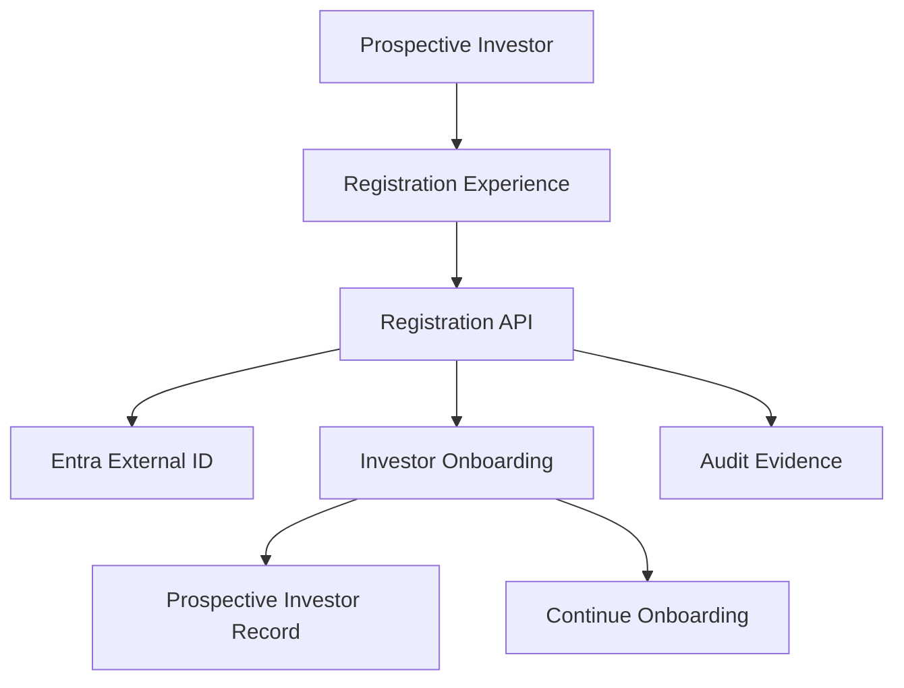

# UC-ONB-001 - Register as a Prospective Investor

**Domain:** Investor Onboarding and Eligibility  
**Primary Actor:** Prospective Investor  
**Priority:** Critical - Priority Tier 1  
**Architecture Status:** Architecture candidate complete - decisions proposed  
**Requirement Evidence:** INFERRED  
**Implementation Status:** IN_DEVELOPMENT  
**E2E Evidence:** NONE  
**Business Use Case Complete:** No  
**Last Updated:** 2026-09-03

## 1. Purpose

Create an identifiable prospective-investor account and start onboarding. Registration establishes an account relationship; it does not establish eligibility, compliance approval, or permission to invest.

## 2. Source Basis

- `docs/04-use-cases/UC-ONB-001.md`
- `docs/03-functional-domains/domains.md`
- `docs/05-business-rules/business-rules.md`
- `docs/02-architecture/high-level-logical-architecture-v0.1.md`
- `docs/02-architecture/azure-mvp-platform-decision.md` (`ARCH-ADR-001`)
- `docs/09-delivery/implementation-coverage-gap-matrix.md`
- Ubuntu Capital OS Priority Use Cases and Business Benefits, 09 August 2026

The requirement is inferred. The priority report confirms the business intent: convert visitors into identifiable prospects and begin the investor pipeline.

## 3. Architecture Analysis

### 3.1 Requirement

The platform must let a prospective investor provide minimum registration information, accept applicable terms, create an account, and receive a clear outcome. Duplicate and invalid registrations must be handled safely.

### 3.2 Current State

`src/pages/Signup.tsx` provides registration UI. No authoritative backend account creation, persistence, identity-provider provisioning, verified contact flow, consent evidence, or end-to-end tests are evidenced.

### 3.3 Target Architecture

- Entra External ID owns credentials and authentication identity.
- Investor Onboarding owns the prospective-investor record and onboarding state.
- A protected backend registration API validates input and coordinates account creation.
- Azure SQL stores authoritative investor/onboarding and consent references.
- Audit records material registration and consent outcomes; telemetry remains separate.

### 3.4 Gap

| Requirement | Current State | Target Architecture | Gap |
|---|---|---|---|
| Create an identifiable prospect and begin onboarding | Signup UI only | Idempotent backend registration coordinated with Entra and investor persistence | Implement API, identity integration, persistence, duplicate handling, consent evidence, audit and E2E tests |

## 4. Business and Logical Flow

**Inputs:** minimum identity/contact data, terms/privacy acceptance, required security inputs.  
**Outputs:** identity reference, prospective-investor record, onboarding status, audit evidence.  
**Exceptions:** duplicate account, invalid input, identity-provider failure, persistence failure, consent not accepted.

## 5. Responsibility and Data Ownership

| Capability/data | Authoritative owner |
|---|---|
| Credentials and authentication identity | Entra External ID |
| Investor/account reference and onboarding state | Investor Onboarding |
| Terms/privacy acceptance evidence | Investor Onboarding / Audit Evidence |
| Operational logs and metrics | Application Insights / Azure Monitor |

Registration must not set `eligible`, `verified`, or `mayInvest` merely because an account exists.

## 6. Azure Technical Direction

React/Vite on Static Web Apps calls an Azure Functions registration API. The function integrates with Entra External ID, persists the application-owned prospect record in Azure SQL, and emits business audit evidence. Key Vault and Managed Identity protect service credentials.

The API must use an idempotency strategy so retries do not create multiple investor records. Where identity creation succeeds but application persistence fails, the workflow must be detectable and recoverable.

## 7. Production and NFR Considerations

- Minimise and encrypt personal data; define retention and deletion rules.
- Rate-limit and protect registration from automation and account enumeration.
- Fail safely on partial creation and alert on orphaned identity/application records.
- Correlate identity-provider and application operations without logging secrets.
- Test duplicate, replay, invalid-consent, dependency-failure, and recovery paths.

## 8. Decisions

| ID | Decision | Status |
|---|---|---|
| ONB1-D01 | Registration creates a prospect, not an eligible investor. | Proposed |
| ONB1-D02 | Entra owns credentials; Ubuntu Capital owns the investor business record. | Inherited from ARCH-ADR-001 / proposed boundary |
| ONB1-D03 | Registration coordination must be idempotent and recoverable across identity and application persistence. | Proposed |
| ONB1-D04 | Eligibility is evaluated by later onboarding/compliance use cases. | Inherited from UC-IAM-001 |

**Needs review:** minimum registration fields, contact-verification policy, consent wording/versioning, duplicate-account matching rule, data-retention policy.

## 9. Related Use Cases and HLA Impact

Related: `UC-IAM-001`, `UC-ONB-002`, `UC-ONB-003`, `UC-INT-001`, `UC-AUD-001`.  
**HLA impact:** Confirm existing IAM and Investor Onboarding capabilities; modify the boundary to show coordinated identity/account creation and consent evidence.

## 10. Status Summary

- Architecture analysis: candidate complete
- Architecture decisions: proposed; business-policy items pending
- Implementation: `IN_DEVELOPMENT`
- E2E evidence: none
- Business use case complete: no

