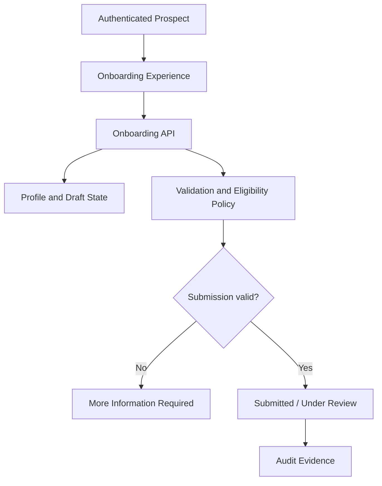

# UC-ONB-002 - Complete Investor Profile and Eligibility Onboarding

**Domain:** Investor Onboarding and Eligibility  
**Primary Actor:** Prospective Investor  
**Priority:** Critical - Priority Tier 1  
**Architecture Status:** Architecture candidate complete - policy decisions pending  
**Requirement Evidence:** INFERRED  
**Implementation Status:** IN_DEVELOPMENT  
**E2E Evidence:** NONE  
**Business Use Case Complete:** No  
**Last Updated:** 2026-09-03

## 1. Purpose

Collect the investor profile, jurisdiction, investor type, interests, and other approved eligibility inputs required to support an eligibility decision. Completing a form is not the same as being approved.

## 2. Source Basis

- `docs/04-use-cases/UC-ONB-002.md`
- `docs/03-functional-domains/domains.md`
- `docs/07-state-models/state-models.md`
- `docs/11-open-questions/open-questions.md`
- `docs/02-architecture/high-level-logical-architecture-v0.1.md`
- `docs/02-architecture/azure-mvp-platform-decision.md`
- `docs/09-delivery/implementation-coverage-gap-matrix.md`
- Ubuntu Capital OS Priority Use Cases and Business Benefits, 09 August 2026

The exact eligibility policy is unknown; the requirement and priority are inferred from project evidence.

## 3. Architecture Analysis

### 3.1 Requirement

The platform must collect, validate, save, resume, and submit the approved set of investor-profile and eligibility information. It must preserve state and evidence sufficient for a later eligibility/compliance decision.

### 3.2 Current State

`src/pages/Onboarding.tsx` contains a multi-step onboarding UI. No authoritative persistence, step recovery, versioned questionnaire, jurisdiction-specific rules, server-side validation, decision workflow, or E2E evidence is present.

### 3.3 Target Architecture

Investor Onboarding owns a versioned onboarding case and profile snapshot. A protected API supports draft save/resume and submission. Eligibility rules are evaluated only against an approved policy version; the resulting eligibility state remains distinct from KYC/AML verification state.

### 3.4 Gap

| Requirement | Current State | Target Architecture | Gap |
|---|---|---|---|
| Capture information needed to determine eligibility | Multi-step UI only | Persistent, versioned onboarding case with validation and controlled submission | Implement schema, draft state, server validation, policy versioning, decision boundary, audit and tests |

## 4. Business and Logical Flow

**Inputs:** profile, jurisdiction, investor type, interests, eligibility questionnaire, policy/consent acknowledgements.  
**Outputs:** versioned profile, onboarding case, validation results, submitted status.  
**Exceptions:** incomplete/invalid fields, stale policy version, session loss, concurrent update, unsupported jurisdiction.

## 5. Responsibility and Data Ownership

| Data/entity | Authoritative owner |
|---|---|
| Investor profile | Investor Onboarding / Profile domain boundary to be reconciled |
| Onboarding case and step state | Investor Onboarding |
| Eligibility policy and decision | Investor Onboarding and Eligibility |
| Identity/KYC evidence | Compliance Verification (`UC-ONB-003`) |
| Material state transitions | Audit Evidence |

The Profile-domain overlap is an explicit boundary question: onboarding owns the submitted eligibility snapshot even if PROFILE later owns editable contact/preferences data.

## 6. Azure Technical Direction

Static Web Apps hosts the form; protected Azure Functions expose draft, resume, validate, and submit endpoints; Azure SQL stores normalized profile/case state and questionnaire/policy versions. Optimistic concurrency prevents silent overwrites. Entra identity links every change to the authenticated prospect.

## 7. Production and NFR Considerations

- Apply field-level validation server-side and minimise sensitive data.
- Encrypt data in transit/at rest; restrict compliance fields by role.
- Record questionnaire version, submitter, timestamps, and decision basis.
- Support resumability without exposing another investor's draft.
- Define retention, correction, deletion, RPO/RTO, and review-SLA requirements.

## 8. Decisions

| ID | Decision | Status |
|---|---|---|
| ONB2-D01 | Onboarding is a persistent stateful case, not a single form submission. | Proposed |
| ONB2-D02 | Profile completion and eligibility approval are separate transitions. | Proposed |
| ONB2-D03 | Decisions must reference the questionnaire/policy version used. | Proposed |
| ONB2-D04 | Authentication supplies identity but does not own eligibility. | Inherited from UC-IAM-001 |

**Needs review:** supported jurisdictions, investor categories/accreditation rules, required fields, automated vs human decisioning, re-assessment/expiry policy, PROFILE-domain ownership split.

## 9. Related Use Cases and HLA Impact

Related: `UC-ONB-001`, `UC-ONB-003`, `UC-INT-001`, `UC-OPP-001`, `UC-AUD-001`, `UC-PROFILE-001`.  
**HLA impact:** Modify Investor Onboarding to expose a versioned eligibility-policy/decision responsibility and clarify profile ownership.

## 10. Status Summary

- Architecture analysis: candidate complete
- Architecture decisions: proposed; regulatory/business policy pending
- Implementation: `IN_DEVELOPMENT`
- E2E evidence: none
- Business use case complete: no

