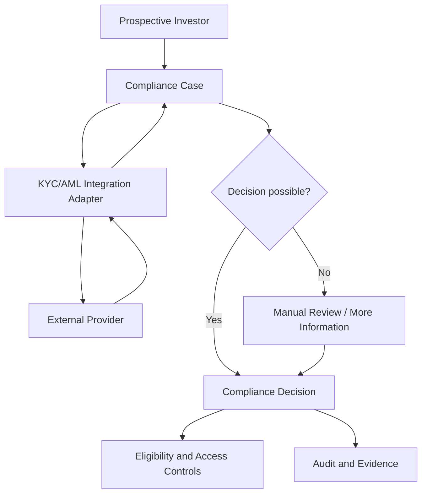

# UC-ONB-003 - Verify Investor Identity and Compliance Status

**Domain:** Investor Onboarding and Eligibility  
**Primary Actor:** Prospective Investor  
**Supporting Actors:** Compliance Operator; External KYC/AML Provider  
**Priority:** Critical - Priority Tier 1  
**Architecture Status:** Architecture candidate complete - blocked from approval by compliance operating-model decisions  
**Requirement Evidence:** INFERRED  
**Implementation Status:** IN_DEVELOPMENT  
**E2E Evidence:** NONE  
**Business Use Case Complete:** No  
**Analysis Mode:** Deep Dive  
**Last Updated:** 2026-09-03

## 1. Purpose

Verify investor identity and establish a defensible compliance status before restricted access or capital activity is permitted. External providers supply evidence/results; Ubuntu Capital remains authoritative for its platform compliance decision.

## 2. Source Basis

- `docs/04-use-cases/UC-ONB-003.md`
- `docs/08-integrations/integration-catalogue.md`
- `docs/11-open-questions/open-questions.md`
- `docs/13-risks/risk-register.md`
- `docs/02-architecture/high-level-logical-architecture-v0.1.md`
- `docs/02-architecture/azure-mvp-platform-decision.md`
- `docs/09-delivery/implementation-coverage-gap-matrix.md`
- Ubuntu Capital OS Priority Use Cases and Business Benefits, 09 August 2026

Provider, jurisdiction, rules, reviewer roles, retention, and legal evidence requirements are unknown.

## 3. Architecture Analysis

### 3.1 Requirement

The system must collect approved verification inputs, initiate identity/compliance checks, receive and correlate provider results, support exception/manual review, make a governed compliance decision, restrict access appropriately, and preserve evidence.

### 3.2 Current State

`src/pages/Onboarding.tsx` contains a Verify placeholder. No KYC/AML integration, compliance case, decision state, evidence store, callback handling, review interface, access enforcement, or E2E evidence exists.

### 3.3 Target Architecture

The Compliance capability owns the verification case and Ubuntu Capital decision. The external provider owns its check execution and response. An integration adapter isolates provider contracts, validates signed callbacks, deduplicates events, and retains provider references rather than making the provider the business system of record.

### 3.4 Gap

| Requirement | Current State | Target Architecture | Gap |
|---|---|---|---|
| Defensible identity/compliance verification | UI placeholder | Controlled compliance case with provider integration, manual review, decision, enforcement and evidence | Select operating model/provider; implement case state, contracts, callbacks, evidence, review, access controls and tests |

## 4. Business and Logical Flow

**Inputs:** verified identity inputs/documents, consent, provider request, policy version.  
**Outputs:** case status, provider references, compliance decision/reason, review tasks, audit evidence.  
**Exceptions:** timeout, callback replay, ambiguous match, provider outage, document rejection, sanctions/PEP alert, manual-review backlog.

## 5. Responsibility and Data Ownership

| Data/entity | Authoritative owner |
|---|---|
| Ubuntu Capital compliance case/decision | Investor Onboarding and Eligibility |
| Provider check/result | External provider; referenced and interpreted by Ubuntu Capital |
| Verification documents | Controlled document/evidence store |
| Restricted-access decision | Relevant business domain using current compliance state |
| Audit trail | Audit and Evidence |

## 6. Azure Technical Direction

Protected Azure Functions implement compliance-case APIs and provider callbacks. Azure SQL stores case/decision state and immutable provider references; Blob Storage stores required documents/evidence under mediated access. Key Vault and Managed Identity protect integration secrets. Callback endpoints require signature validation, replay protection, idempotency, correlation, and controlled retries.

## 7. Production and NFR Considerations

- Treat identity and compliance data as highly sensitive; minimise, encrypt, segregate, and audit access.
- Fail closed for restricted actions when status is absent, expired, suspended, or unverifiable.
- Provide a manual-review path and operational queues for exceptions.
- Monitor provider availability, callback lag, stuck cases, and decision SLA.
- Establish retention/deletion and cross-border data-transfer rules before production.

| Failure | Business impact | Mitigation |
|---|---|---|
| Provider unavailable | Onboarding blocked | Persist case, show pending state, retry safely, alert operations |
| Duplicate callback | Conflicting state | Idempotency key/event ledger and monotonic transition validation |
| False or ambiguous match | Incorrect restriction/approval | Manual review, reason evidence, governed override |
| Evidence inaccessible | Decision not defensible | Durable evidence references, integrity checks, backup/restore tests |

## 8. Decisions

| ID | Decision | Status |
|---|---|---|
| ONB3-D01 | Ubuntu Capital owns the platform compliance decision; provider results are inputs. | Proposed |
| ONB3-D02 | Compliance verification is a stateful case with manual-review capability. | Proposed |
| ONB3-D03 | Provider integration uses an adapter and idempotent callback processing. | Proposed |
| ONB3-D04 | Restricted actions fail closed when required compliance state is not valid. | Proposed |

**Blocking review:** jurisdictions/rules, KYC/AML provider, reviewer authority and override model, evidence/retention requirements, re-screening/expiry triggers, document residency.

## 9. Related Use Cases and HLA Impact

Related: `UC-ONB-002`, `UC-INT-001`, `UC-OPP-001`, `UC-DD-002`, `UC-INV-001`, `UC-AUD-001`, `UC-ADMIN-003`.  
**HLA impact:** Modify the Integration Boundary to add a KYC/AML adapter and confirm Compliance Decision and Verification Evidence as separate owned facts.

## 10. Status Summary

- Architecture analysis: candidate complete
- Architecture approval: blocked by compliance operating-model decisions
- Implementation: `IN_DEVELOPMENT` (placeholder only)
- E2E evidence: none
- Business use case complete: no

