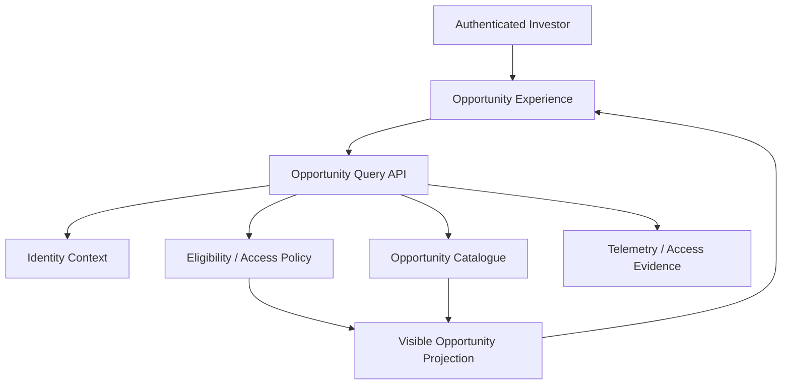

# UC-OPP-001 - Browse Visible Investment Opportunities

**Domain:** Opportunity Management  
**Primary Actor:** Eligible Investor  
**Priority:** Critical - Priority Tier 2  
**Architecture Status:** Architecture candidate complete - access-policy decisions pending  
**Requirement Evidence:** INFERRED  
**Implementation Status:** COMPONENT_COMPLETE (UI level only)  
**E2E Evidence:** NONE  
**Business Use Case Complete:** No  
**Last Updated:** 2026-09-03

## 1. Purpose

Present the set of currently visible investment opportunities to an investor according to publication and access policy. This is the core marketplace discovery experience, but a rendered card does not prove authorised or current opportunity supply.

## 2. Source Basis

- `docs/04-use-cases/UC-OPP-001.md`
- `docs/03-functional-domains/domains.md`
- `docs/05-business-rules/business-rules.md`
- `docs/02-architecture/high-level-logical-architecture-v0.1.md`
- `docs/02-architecture/priority-use-case-architecture-map.md`
- `docs/02-architecture/azure-mvp-platform-decision.md`
- `docs/09-delivery/implementation-coverage-gap-matrix.md`
- Ubuntu Capital OS Priority Use Cases and Business Benefits, 09 August 2026

## 3. Architecture Analysis

### 3.1 Requirement

An authorised investor must be able to browse opportunities that are published, active, and visible under applicable investor-access rules. The platform must not expose restricted or stale opportunity information.

### 3.2 Current State

`src/pages/Opportunities.tsx`, `src/components/HoverExpandCard.tsx`, and `src/data/opportunities.ts` implement opportunity cards/categories using static local data. No canonical catalogue API, authoritative lifecycle source, server-side visibility policy, freshness control, or end-to-end access test is evidenced.

### 3.3 Target Architecture

Opportunity Management owns opportunity catalogue and publication state. A protected query API combines authenticated identity with current eligibility/access policy and returns only a permitted projection. Due-diligence access is not implied by opportunity visibility.

### 3.4 Gap

| Requirement | Current State | Target Architecture | Gap |
|---|---|---|---|
| Browse only current, permitted opportunities | Static client data and cards | Canonical server-side catalogue with publication and visibility enforcement | Implement persistence/API, access-policy evaluation, lifecycle/freshness controls, audit/telemetry and E2E tests |

## 4. Business and Logical Flow

**Inputs:** identity context, investor access state, filters/paging, current publication time.  
**Outputs:** authorised opportunity summaries and paging metadata.  
**Exceptions:** unauthenticated caller, ineligible/restricted investor, withdrawn opportunity, stale cache/data-source failure.

## 5. Responsibility and Data Ownership

| Data/entity | Authoritative owner |
|---|---|
| Opportunity catalogue and lifecycle | Opportunity Management |
| Investor eligibility | Investor Onboarding and Eligibility |
| Authentication context | IAM / Entra External ID |
| NDA/data-room grant | Due Diligence |
| Browse telemetry | Application Insights / Azure Monitor |

## 6. Azure Technical Direction

Static Web Apps calls a protected Azure Functions query endpoint. The endpoint validates Entra identity, evaluates server-side visibility rules, and reads canonical opportunity data from Azure SQL. Use a least-data projection; do not send restricted detail and hide it only in the browser. Caching is optional and must respect lifecycle/access changes.

## 7. Production and NFR Considerations

- Server-side authorization is mandatory; frontend filtering is not a control.
- Define freshness expectations and immediate withdrawal/closure behaviour.
- Support paging and indexed queries before speculative caching.
- Avoid leaking restricted records through counts, search, logs, or error messages.
- Monitor query latency, empty/error rates, policy denials, and stale-publication incidents.

## 8. Decisions

| ID | Decision | Status |
|---|---|---|
| OPP1-D01 | Opportunity Management is authoritative for catalogue and publication state. | Proposed / HLA-confirming |
| OPP1-D02 | Visibility is enforced server-side using identity plus business access state. | Proposed; inherits UC-IAM-001 |
| OPP1-D03 | Opportunity visibility does not grant confidential due-diligence access. | Proposed |
| OPP1-D04 | MVP uses a simple query API and relational persistence; no search engine/cache is justified yet. | Proposed |

**Needs review:** public vs authenticated catalogue scope, eligible-only rule, jurisdiction/product restrictions, embargo and withdrawal timing, freshness SLA.

## 9. Related Use Cases and HLA Impact

Related: `UC-IAM-001`, `UC-ONB-002/003`, `UC-OPP-003`, `UC-ADMIN-001/002`, `UC-DD-001/002`, `UC-AUD-001`.  
**HLA impact:** Confirm Opportunity Management ownership; modify access flow to show server-side policy composition and separate public summary from confidential access.

## 10. Status Summary

- Architecture analysis: candidate complete
- Architecture decisions: proposed; visibility policy pending
- Implementation: `COMPONENT_COMPLETE` at UI level only
- E2E evidence: none
- Business use case complete: no

