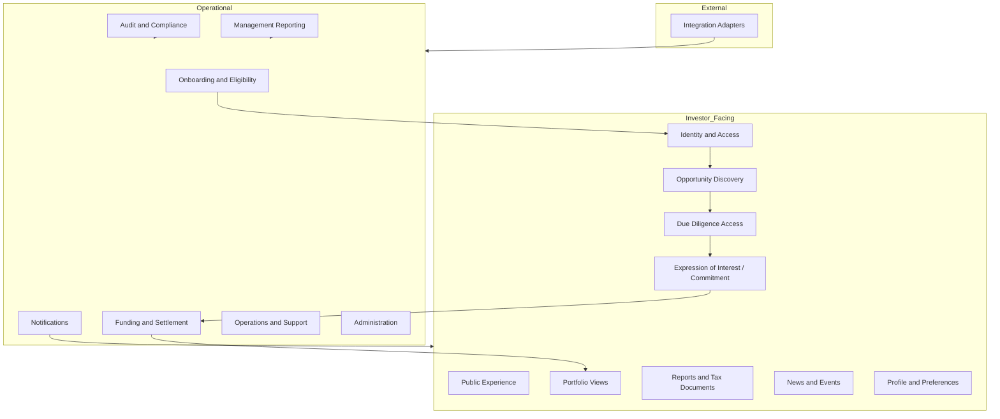

# Capability Map

Status: `ANALYSIS_IN_PROGRESS`

## Domain dependency notes

- IAM and AUD are cross-cutting prerequisites for sensitive workflows.
- SET and INT remain blocked by unresolved legal and provider evidence.
- Foundation and first-slice sequencing is governed by docs/09-delivery/foundation-slice-a-governance-reconciliation.md.
