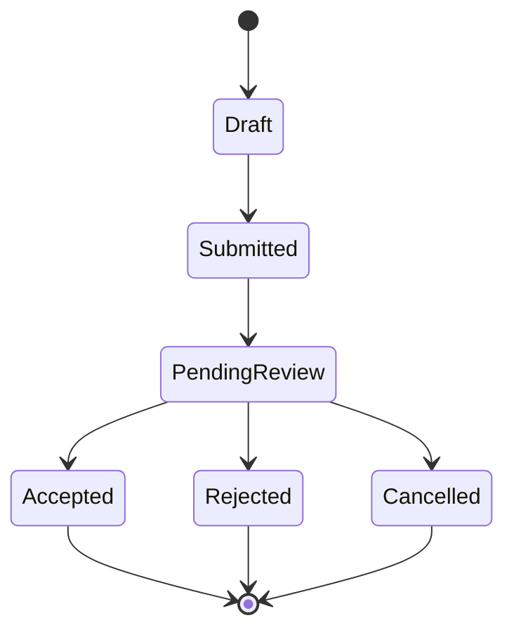

# State Models

Status: `ANALYSIS_IN_PROGRESS`

## Candidate lifecycle models

| Model ID | Entity | Evidence Status | Notes |
|---|---|---|---|
| STM-001 | Session | INFERRED | Needs explicit expiry/logout states. |
| STM-002 | Investor onboarding | INFERRED | Eligibility/accreditation checkpoints unresolved. |
| STM-003 | Opportunity | INFERRED | Draft/open/paused/closed/archived not confirmed. |
| STM-004 | NDA/access grant | INFERRED | Trigger seen; full lifecycle unknown. |
| STM-005 | EOI/commitment | INFERRED | First slice non-binding, terminal states unresolved. |
| STM-006 | Settlement record | UNKNOWN | Blocked by OQ-004 and OQ-005. |
| STM-007 | Document availability | INFERRED | Publication and retention rules unresolved. |

## Example model: EOI lifecycle (non-binding)

