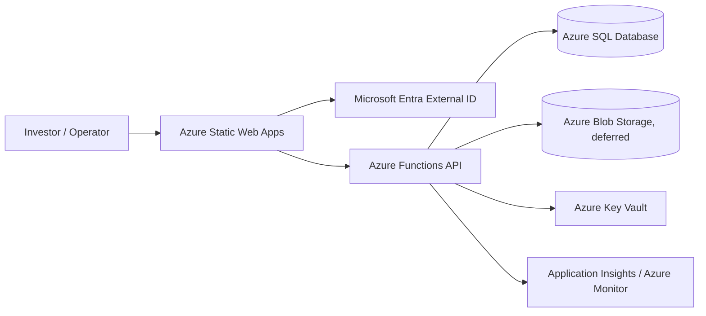

# Ubuntu Capital OS Reconstruction and Delivery Session

## Document Control

| Field | Value |
|---|---|
| Project | Ubuntu Capital OS |
| Repository | ubuntu-capital-os |
| Session Date | 2026-09-01 |
| Session Source | Mixed |
| Session Type | Repository discovery and implementation planning |
| Related Story or Ticket | Not established |
| Primary Objective | Reconstruct the supplied reference investment platform into an evidence-first, traceable functional model and execute the canonical repository plan without silently manufacturing facts. |
| Document Status | Draft knowledge capture |

## 1. Executive Summary

This session centered on the Ubuntu Capital OS repository and the controlling execution plan for a system-reconstruction effort tied to an OurCrowd-style private investment platform. The evidence reviewed establishes a clear operating model: the repository is governed by [AGENT.md](../../AGENT.md) and the execution sequence in [plan.md](../../plan.md), and the repo’s public summary in [README.md](../../README.md) states the current status as `PARTIALLY_READY` rather than deployment-ready.

The most important facts are that the project has a confirmed technical direction for an Azure MVP architecture, but no use case has objective E2E completion evidence. The repository also contains a set of plan-required outputs that remain incomplete or structurally misaligned, which blocks Foundation Slice A progression until those gaps are reconciled. The session therefore resolves to a disciplined evidence-first reconstruction approach: preserve uncertainty, classify findings, and move only when the required evidence and repository integrity checks are satisfied.

## 2. Objective and Scope

### Objective

The session aimed to establish the current system baseline, validate the repository’s governing rules, and identify the concrete repository readiness and delivery constraints before any further implementation progress.

### In Scope

- Governing instructions from [AGENT.md](../../AGENT.md)
- Execution sequence and required outputs from [plan.md](../../plan.md)
- Current repository status, architecture decision, and implementation readiness captured in [README.md](../../README.md)
- Repository structure, evidence handling, classification, and gating rules
- Risk and sequencing constraints related to Foundation Slice A and the first business vertical slice

### Out of Scope

- Deep source-code inspection of the external live implementation repository
- Policy or legal review of regulated investment behaviour or KYC/AML processes
- Any speculative platform redesign beyond the evidence-first reconstruction and delivery logic captured in the repo

## 3. System Context

The repository presents Ubuntu Capital OS as an evidence-first system-reconstruction and delivery effort for rebuilding an OurCrowd-inspired private-markets investment platform one end-to-end use case at a time. The repo’s current public summary identifies the live website and the external implementation repository, while explicitly stating that the repository cannot directly inspect the external platform source and therefore treats prior implementation coverage as recorded provenance rather than fresh implementation proof.

The architecture direction is materially defined in [README.md](../../README.md):

- Azure Static Web Apps for the frontend
- Microsoft Entra External ID for identity
- Azure Functions for backend compute
- Azure SQL Database for persistence where required
- Azure Blob Storage for document or generated-file storage when the business slice requires it
- Azure Key Vault, Managed Identity, App Insights, Azure Monitor, and Cost Management
- GitHub Actions or Azure DevOps for CI/CD

This is a target architecture decision, not evidence that the stack is already operating in production or that the associated Azure resources are fully provisioned.

## 4. Current State and Target State

| Area | Current State | Target State | Gap | Status |
|---|---|---|---|---|
| Governance | Controlled by [AGENT.md](../../AGENT.md) and [plan.md](../../plan.md) | Repository operations continue under the controlling plan | No direct gap in authority; plan-required outputs remain incomplete | Confirmed |
| Repository completeness | README indicates the repo is `PARTIALLY_READY` | Canonical output tree and traceability are complete and reconciled | Missing or misaligned canonical outputs, including actor/permission and validation artifacts | Blocked |
| Architecture direction | Azure MVP platform is confirmed in docs | Azure architecture is implemented only when evidence and constraints permit | Architecture decision is not equivalent to deployed implementation | Confirmed |
| Use-case completion | No use case is recorded as `COMPLETE` | End-to-end evidence supports completion for each target slice | No objective E2E validation evidence exists for the current implementation set | Confirmed |
| Foundation delivery | Foundation Slice A is deferred pending governance reconciliation | Foundation implementation may proceed only after repository gate reconciliation | Gate is not yet satisfied | Blocked |

## 5. Key Findings

### Finding 1: The repository is deliberately governed by an evidence-first operating model

**Status:** Confirmed

**Finding:** The operating rules in [AGENT.md](../../AGENT.md) are explicit: classify findings as `CONFIRMED`, `INFERRED`, `UNKNOWN`, or `CONTRADICTED`; do not turn assumptions into facts; and do not advance implementation when required outputs or evidence are missing.

**Evidence:** [AGENT.md](../../AGENT.md) and [plan.md](../../plan.md) define the control flow, required outputs, evidence classifications, and repository validation rules.

**Why it matters:** This makes the project a reconstruction and traceability exercise rather than a speculative build. It protects against confirmation bias and invalid implementation claims.

### Finding 2: The repository is currently below the plan-defined completion gate

**Status:** Confirmed

**Finding:** The repo summary explicitly notes that the canonical plan outputs and integrity conditions have not fully reconciled, which blocks Foundation Slice A progression.

**Evidence:** [README.md](../../README.md) states that the repository remains below implementation readiness and that Foundation implementation must not start or advance until the gate is satisfied.

**Why it matters:** Any migration, infrastructure rollout, or vertical-slice work without this reconciliation would violate the controlling project rules.

### Finding 3: Architecture was decided, but implementation status remains separate from architecture status

**Status:** Confirmed

**Finding:** The repo confirms the Azure MVP architecture direction, but this is not equivalent to proof of a deployed or integrated system. The implementation coverage matrix still reports zero `COMPLETE` use cases.

**Evidence:** [README.md](../../README.md) records the Azure platform decision and the implementation coverage status. The repository also distinguishes target architecture from implementation evidence.

**Why it matters:** The project can have a strong target architecture without having validated delivery evidence. This is a critical distinction for planning and approvals.

## 6. Technical and Business Knowledge

### Technical Concepts

| Concept | Meaning in This Context | Why It Matters |
|---|---|---|
| Evidence-first reconstruction | Validate claims against supplied evidence before treating them as repository facts | Prevents speculative platform behaviour or fake completion |
| Foundation Slice A | Planned Azure infrastructure package that must pass governance reconciliation before execution | Keeps infra work aligned to the repository gate and delivery rules |
| Vertical slice | A complete end-to-end business flow spanning UI, API, domain rules, persistence, security, tests, and evidence | Reduces premature implementation and preserves traceability |
| E2E completion evidence | Proof that a use case works end-to-end, not just that a screen or component exists | Required before a use case can be marked complete |

### Business Rules and Acceptance Criteria

| ID | Requirement or Rule | Status | Implementation Impact |
|---|---|---|---|
| BR-01 | Every material finding must be classified as `CONFIRMED`, `INFERRED`, `UNKNOWN`, or `CONTRADICTED` | Confirmed | Forces explicit uncertainty management and prevents silent assumption leakage |
| BR-02 | A use case may not be marked `COMPLETE` without objective end-to-end evidence | Confirmed | Delays delivery claims until validated evidence exists |
| BR-03 | Foundation implementation must be gated by repository integrity reconciliation | Confirmed | Prevents premature cloud or deployment execution |
| AC-01 | The canonical repository structure defined in [plan.md](../../plan.md) must remain authoritative | Confirmed | Reduces structural drift and conflicting documentation |

## 7. Decisions and Implementation

### Decisions

| ID | Decision | Status | Rationale | Consequence |
|---|---|---|---|---|
| DEC-01 | Preserve evidence-first reconstruction security and traceability requirements | Confirmed | The project explicitly forbids inventing behaviour or overstating completion | The platform is modelled from evidence, not hypothesis |
| DEC-02 | Use the Azure MVP architecture as the target platform direction | Confirmed | The repo documents a clear target stack for feasibility and planning | Architecture is directional rather than deployed |
| DEC-03 | Delay Foundation Slice A until the repo integrity gate is reconciled | Confirmed | The project rules require it before implementation proceeds | Prevents premature infrastructure work |
| DEC-04 | Treat implementation coverage from external sources as provenance, not as fresh proof | Confirmed | The repo cannot directly inspect the external implementation repository | Completion claims remain cautiously bounded |

### Implementation

| Component or File | Change | Reason | Status |
|---|---|---|---|
| [AGENT.md](../../AGENT.md) | Governing agent rules and evidence handling | Establishes execution discipline and truth classification | Confirmed |
| [plan.md](../../plan.md) | Canonical execution order and required output definition | Defines the system-reconstruction programme and output traceability | Confirmed |
| [README.md](../../README.md) | Current repository status and architecture decision summary | Provides a controlled checkpoint of readiness and blockers | Confirmed |
| [docs/00-context](../../docs/00-context) | Source inventory and context materials | Supports evidence capture and scope control | Partially Implemented |
| [docs/01-system-understanding](../../docs/01-system-understanding) | Assumptions and system understanding | Provides cross-check for business and technical context | Partially Implemented |
| [docs/02-architecture](../../docs/02-architecture) | Architecture baseline and decisions | Records the logical architecture and target platform path | Confirmed |
| [docs/09-delivery](../../docs/09-delivery) | Governance, backlog, tracking, and implementation analysis | Supplies delivery sequencing and readiness controls | Partially Implemented |

## 8. Errors and Troubleshooting

| Field | Detail |
|---|---|
| Error | Repository integrity gaps remain unresolved relative to the canonical plan |
| Affected Component | Structural delivery, implementation readiness, and Foundation gating |
| Relevant Evidence | [README.md](../../README.md) and [plan.md](../../plan.md) explicitly call out missing or misaligned outputs and infer that current readiness is partial |
| Cause | The repo contains an architecture tree and other outputs that are not fully reconciled to the canonical structure and required evidence set |
| Investigation | Checked the governing instructions and the repository summary to compare real repo state against the required execution plan |
| Resolution | Reconcile the output set and evidence gate before Foundation work proceeds |
| Status | Blocked |

## 9. Validation, Risks, and Open Questions

### Validation

Validation is constrained by the repo’s own rules. The current evidence supports the following:

- The project has a governing execution plan and evidence policy.
- The architecture direction is documented and explicit.
- The repository has a known readiness gap and a Foundation work block.
- No complete end-to-end implementation evidence is recorded for the target use cases.

### Risks

| Risk | Impact | Status |
|---|---|---|
| Premature implementation before repository gating | Invalid infrastructure or development work; wasted effort | Confirmed |
| Overclaiming technical completeness from architecture or prototype status | Misleading delivery status and incorrect stakeholder expectations | Confirmed |
| Insufficient business evidence for KYC/AML, NDA, custody, and reporting behaviour | The platform cannot be faithfully reconstructed for regulated finance flows | Unverified but acknowledged |

### Open Questions

- What exact onboarding and eligibility rules govern investor access?
- What are the confirmed KYC/AML, legal, and custody boundaries?
- Which due-diligence and NDA flows are mandatory versus optional?
- What is the authoritative evidence source for the current live implementation?
- Which repository outputs remain missing or inconsistent, and what is the exact repair order?

## 10. Conclusion

The session establishes that Ubuntu Capital OS is a disciplined reconstruction effort rather than an ad hoc build. The controlling plan and the project summary agree on the central constraint: the repository is not yet ready to advance Foundation implementation because the required outputs, evidence traceability, and repository integrity checks are not reconciled. The target architecture is clear and credible, but it remains a planning direction until validated by repository evidence and end-to-end business proof.

The most important next action is not a platform build; it is the disciplined repair of the repo gate and the evidence trail required by [AGENT.md](../../AGENT.md) and [plan.md](../../plan.md). Once those conditions are satisfied, the organisation can move into the formal use-case reconstruction and Foundation Slice A execution sequence without overstating progress.
